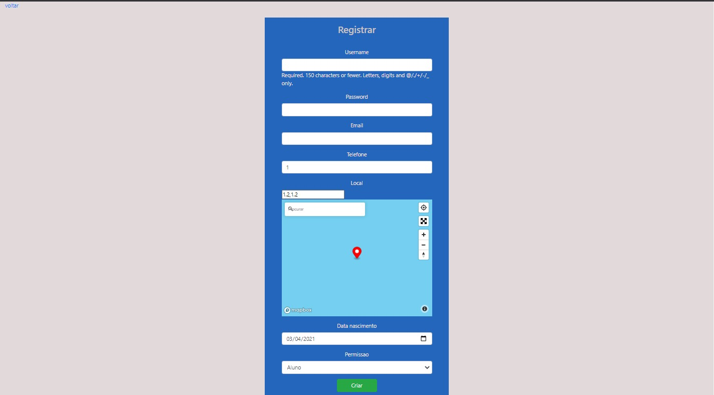

## Sistema de suporte ao transporte
Sistema para auxiliar motoristas de van no gerenciamento de suas turmas, o sistema esta hospedado [aqui](https://tcctransporte.herokuapp.com/)

## Tecnologias usadas

Construido com

- [Django](https://www.djangoproject.com/) utilizado para a construção do site
- [Mapbox](https://www.mapbox.com/) utilizado para gerar os mapas e rotas do sistema

## Tela de login

Nessa tela é informado o nome do usuario e a senha para realizar o login

## Tela de registro

Nessa tela sera criado o login, informando o nome de usuario, senha, email, telefone, localização do usuario, data de nascimento e se o usuario é um aluno ou um motorista.

## Area do motorista